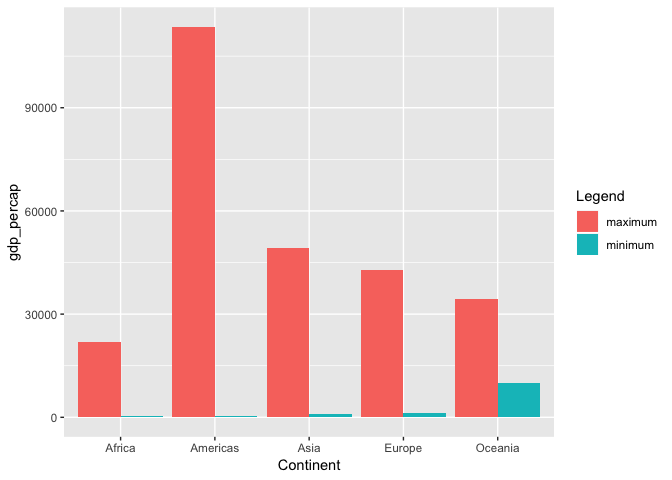
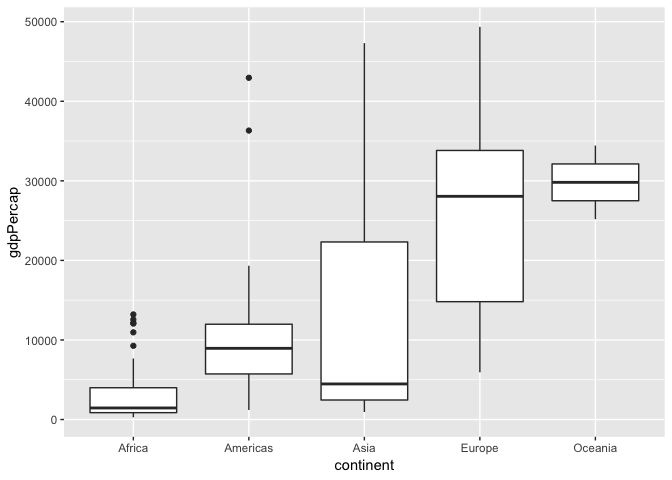
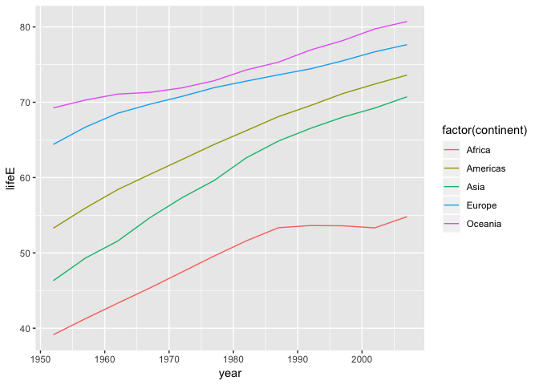

Let's import the gapminder dataset, dplyr, and tidyverse, so that we can actually do this assignment! Supress all the startup messages and warnings as well.

```r
library(gapminder)
library(tidyverse)
suppressPackageStartupMessages(library(tidyverse))
```

# Task 2

In this task, we are trying to find the maximum and minimum GDP per capita for all continents. I've added comments to the R code to show you (the reader) what I am doing in each step.

This is the tibble for finding the minimum GDP for each continent.

```r
minG <- gapminder %>% 
  group_by(continent) %>%             
  mutate(min_gdp = min(gdpPercap)) %>% # Create column of the minimum GDP by continent. 
  filter(gdpPercap == min_gdp) %>% # Extract the only one that is the minimum.
  select(continent, min_gdp) # Select the continent and minimum so we can compare.

minG
```

```
## # A tibble: 5 x 2
## # Groups:   continent [5]
##   continent min_gdp
##   <fct>       <dbl>
## 1 Oceania    10040.
## 2 Europe       974.
## 3 Africa       241.
## 4 Americas    1202.
## 5 Asia         331
```
From the above tibble, we found the minimum GDP per capita for each continent. Next, repeat this exact same code, except to find the maximum GDP per capita.


```r
maxG <- gapminder %>% 
  group_by(continent) %>%             
  mutate(max_gdp = max(gdpPercap)) %>% # Create column of the minimum GDP by continent. 
  filter(gdpPercap == max_gdp) %>% # Extract the only one that is the minimum.
  select(continent, max_gdp) # Select the continent and minimum so we can compare.

maxG
```

```
## # A tibble: 5 x 2
## # Groups:   continent [5]
##   continent max_gdp
##   <fct>       <dbl>
## 1 Oceania    34435.
## 2 Asia      113523.
## 3 Africa     21951.
## 4 Europe     49357.
## 5 Americas   42952.
```
Combining these 2 dataframes together gives us:


```r
combined <- full_join(minG, maxG)
```

```
## Joining, by = "continent"
```

```r
combined
```

```
## # A tibble: 5 x 3
## # Groups:   continent [5]
##   continent min_gdp max_gdp
##   <fct>       <dbl>   <dbl>
## 1 Oceania    10040.  34435.
## 2 Europe       974.  49357.
## 3 Africa       241.  21951.
## 4 Americas    1202.  42952.
## 5 Asia         331  113523.
```

Then, plotting this data using paired bar graphs, we get:

```r
Continent <- c(rep("Oceania", 2), rep("Asia" , 2) , 
               rep("Africa" , 2) , rep("Europe" , 2) , 
               rep("Americas" , 2) )
Legend <- rep(c("minimum" , "maximum") , 5)
gdp_percap <- c(combined$min_gdp[1], combined$max_gdp[1],
           combined$min_gdp[2], combined$max_gdp[2],
           combined$min_gdp[3], combined$max_gdp[3],
           combined$min_gdp[4], combined$max_gdp[4],
           combined$min_gdp[5], combined$max_gdp[5])
data <- data.frame(Continent,Legend,gdp_percap)
 
# Grouped
ggplot(data, aes(fill=Legend, y=gdp_percap, x=Continent)) + 
    geom_bar(position="dodge", stat="identity")
```

<!-- -->
In this graph, we can easily see the change in GDP per Capita. However, the min and max can possibly come from separate years, so be aware of that. Please note: I learned how to do this graph from the following website: https://www.r-graph-gallery.com/48-grouped-barplot-with-ggplot2.html. Also, as a personal note, this graph was the most difficult to make, probably because ggplot2 doesn't have a built in function to produce graphs like this. 

# Task 3

In this section, we will be looking at the spread of GDP per capita within the continents. In order to do this, we will need to focus on one specific year. We will look at the year 2007.


```r
gdpspread <- gapminder %>%
  filter(year == "2007") %>% 
  select(continent, country, gdpPercap) %>% 
  group_by(continent)
gdpspread
```

```
## # A tibble: 142 x 3
## # Groups:   continent [5]
##    continent country     gdpPercap
##    <fct>     <fct>           <dbl>
##  1 Asia      Afghanistan      975.
##  2 Europe    Albania         5937.
##  3 Africa    Algeria         6223.
##  4 Africa    Angola          4797.
##  5 Americas  Argentina      12779.
##  6 Oceania   Australia      34435.
##  7 Europe    Austria        36126.
##  8 Asia      Bahrain        29796.
##  9 Asia      Bangladesh      1391.
## 10 Europe    Belgium        33693.
## # … with 132 more rows
```
This gives us a tibble of the GDP Per Capita for each continent in 2007. However, we may want to look at the distribution of GDP for each individual continent. We will look at box plots to demonstrate this.


```r
gdpspread %>% 
  ggplot(aes(continent, gdpPercap)) +
  geom_boxplot()
```

<!-- -->
As you can see, the Boxplot shows the spread of the GDP for each Continent in the year 2007. Asia varies widly, whereas Europe has a higher GDP Per cap than Americas and Africa. 

# Task 5

How is life expectancy changing over time in different continents? To analyze this question, we will group into continents. Then, we will find the average life expectancy in each year. Finally, we can plot the trends of the 5 different continents on the same graph to see the average life expectancy change. 


```r
avgLE <- gapminder %>% 
  group_by(continent, year) %>% 
  summarize(mean(lifeExp)) %>% 
  rename(lifeE = "mean(lifeExp)")
avgLE
```

```
## # A tibble: 60 x 3
## # Groups:   continent [5]
##    continent  year lifeE
##    <fct>     <int> <dbl>
##  1 Africa     1952  39.1
##  2 Africa     1957  41.3
##  3 Africa     1962  43.3
##  4 Africa     1967  45.3
##  5 Africa     1972  47.5
##  6 Africa     1977  49.6
##  7 Africa     1982  51.6
##  8 Africa     1987  53.3
##  9 Africa     1992  53.6
## 10 Africa     1997  53.6
## # … with 50 more rows
```
Now that we have the tibble, we need to plot this data. Let's go!

Using continent as our factor, we can plot all 5 lines on the same plot. See the legend as well for the colour corresponding to each continent. 


```r
avgLE %>% 
  ggplot(aes(year, lifeE)) +
  geom_line(aes(color = factor(continent)))
```

<!-- -->
In general, the average life expectancies across the continents are increasing. From 1950 to about 1980, most of them increase at the same rate, besides Oceania. Then after 1980, Africa tends to flat line, whereas the others tend to steadily increase. 

